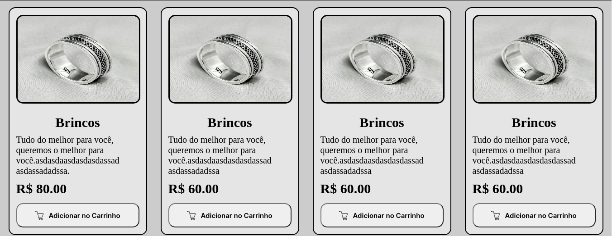
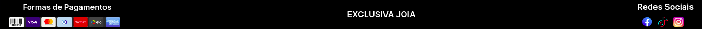
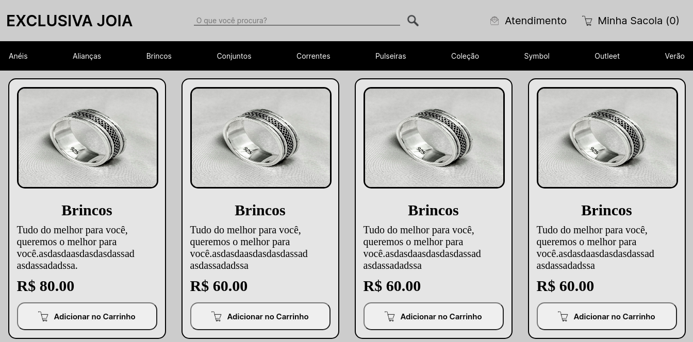

# Projeto COVID-19
* Projeto em Reactjs usando Nextj, onde vou está aplicando alguns conceitos aprendidos e com algumas modificações, esse projeto vai retratar um ecommerce de venda de joias em pratas.

* Dentro do <b>README</b> da pasta do projeto está tudo que está sendo usando.
   * https://github.com/thiagoadssilva/thiagoExclusivaJoiaEcommerce/blob/main/frontendnext/README.md

## Protótipo criado com a plataforma 'FIGMA'
  * https://www.figma.com/proto/wRZ96rz5GuueKdytxPD1Ce/PROJETO-SITE?node-id=4%3A31&scaling=scale-down

<!-- ## Projeto Publicado
- http://covid19.tfcoder.com/

 -->

## <b>HEADER</b> 

## <b>Body</b> 

## <b>Footer</b> 

## <b>Painel Pincipal</b> 

